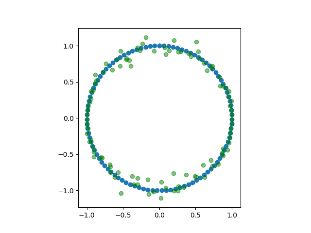
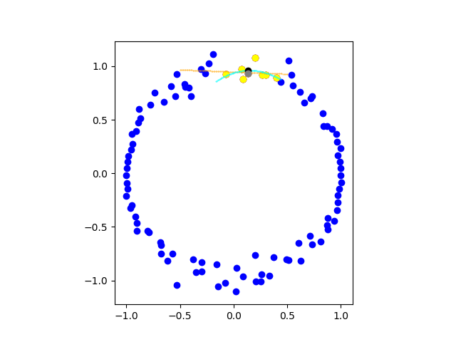
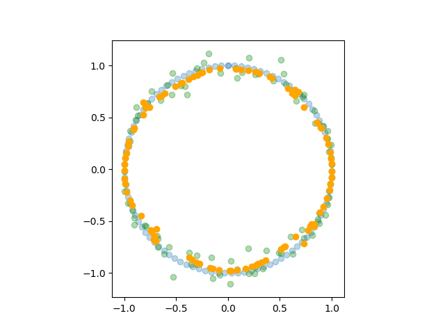
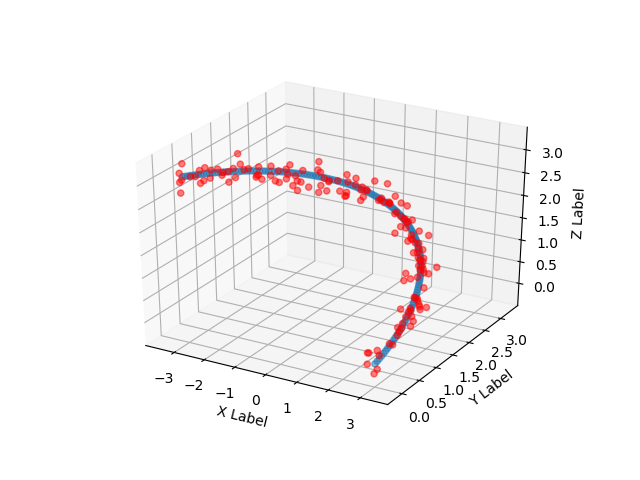
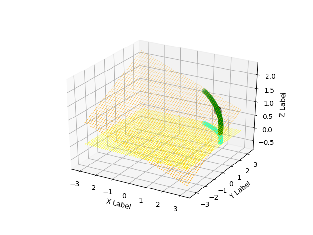
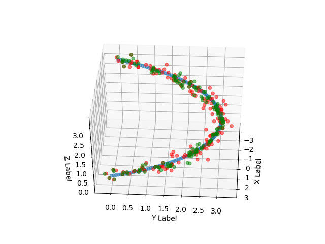

# Curver: 2D & 3D noisy point-cloud (of a curve) thinner

Based on the paper: <http://citeseerx.ist.psu.edu/viewdoc/download?doi=10.1.1.103.6770&rep=rep1&type=pdf>

+ Settings are in `curver_config.py`
+ Examples are runnable: `python3 example2d.py`, `python3 example3d.py`
+ Requires `scipy >= 1.2`

## Example screenshots

### 2D

A noisy circle and the original circle.

An illustration of the operation of the algorithm on a single point. The gray point is mapped to the black point.

Results of three iterations (results in orange):

### 3D

A noisy piece of a helix and the original.

An illustration of the operation of the algorithm on a single point. The best-fit plane is found and points are projected onto the yellow plane (projected points in cyan). Then the 2D algorithm is run on the single point inside the yellow plane, as illustrated above.

Results of several iterations (results in green):

